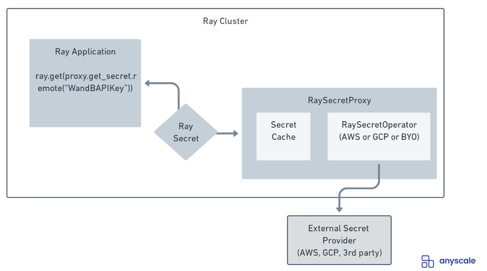

# Ray Secret Proxy

## DISCLAIMER
The Ray Secret Proxy is not an officially supported project by Ray or Anyscale. 

## Background
Credentials are required for almost every application to interact with databases, external APIs, and 3rd party integrations.  Meanwhile, securely assessing, storing, and applying them within application logic poses a risk for potential credential exposure.

A straightforward approach to credential management is the use of environment variables, however these variables are not encrypted and easily accessible by other processes on a machine.

To combat this, vendors have created Secret Management systems to provide mechanisms securely store, manage, and leverage secrets within applications.  However, each of these systems requires intimate knowledge of the specific secret provider in order to build an application client.

## Usage
Before you begin, you will need to grant an IAM Role an IAM Policy that allows your Ray cluster to access your target Secrets Proxy.  It is highly recommended to only grant read and list permissions for the Secret Manager for the IAM Role attached to your Ray clusters.

For information on how to use the [Ray Secrets Proxy](./ray_secret_proxy.py), please visit our [Walkthrough notebook](./walkthrough.ipynb).  

## Architecture

The Ray Secrets Proxy is an actor that can deployed within a Ray cluster and accessed as part of the Ray application to fetch credentials for 3rd parties applications, data bases, etc.

The Secrets Proxy leverages a Pluggable Ray Secret Operator that conforms to a standard interface to list and fetch credentials from a third party Secrets Manager.  

## Ray Secret Operators
Today, there are out of the box Ray Secret Operators for AWS and GCP Secret Managers.  These Operators are based off of the [RaySecretOperator](./ray_secret_operator.py) class and implement the following methods:
- initialize: a public method that initializes the client within the Proxy Actor to connect to your 3rd party Secret Store
- _fetch: the private method that retrieves a secret from the underlying Secret Providor
- get_secret: the public method to return a RaySecret from the provider
- list_secrets: the public method to return a list of secrets from the provider

Additional Secret Managers can be added by implementing additional operators based off of the base Ray Secret Operator.
